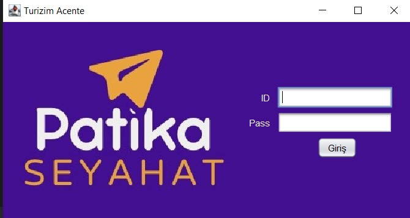
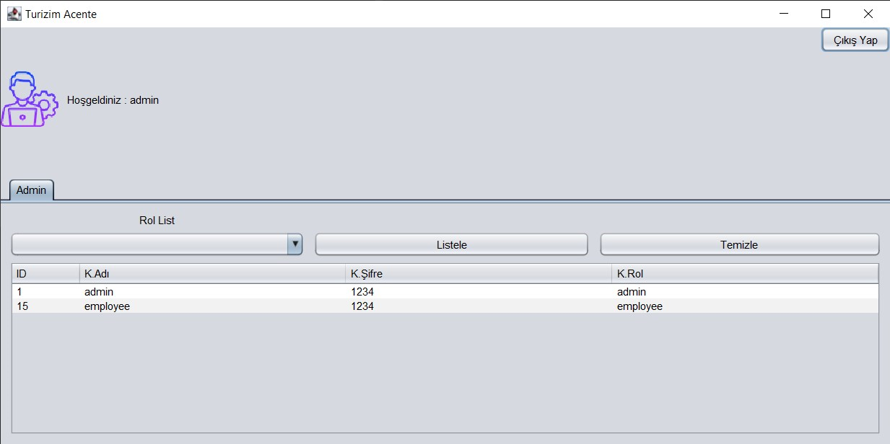
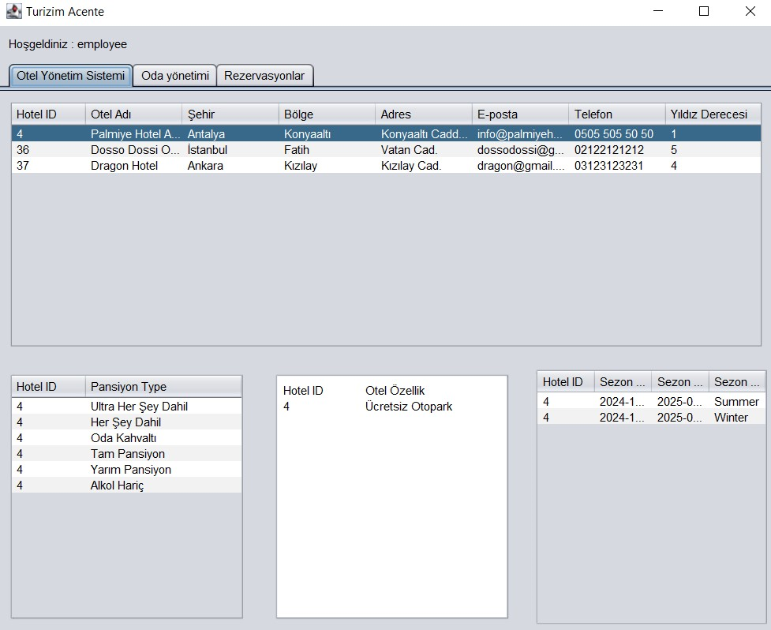
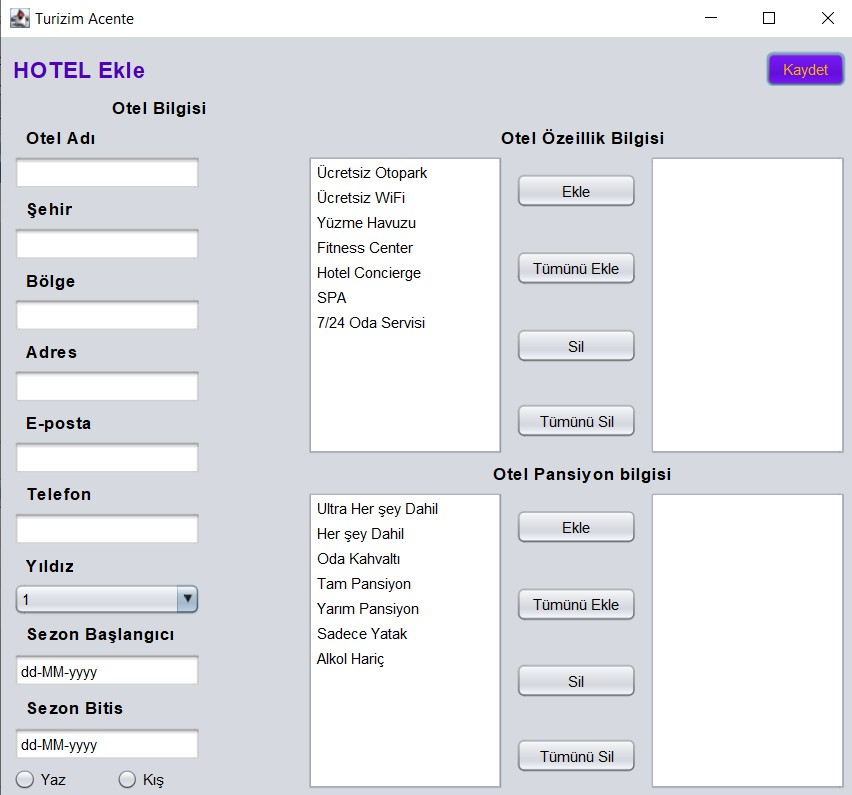
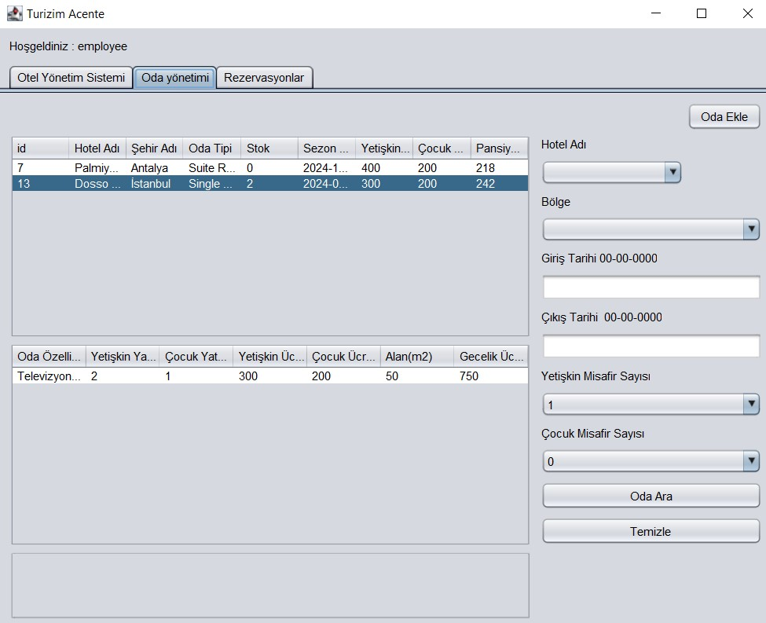
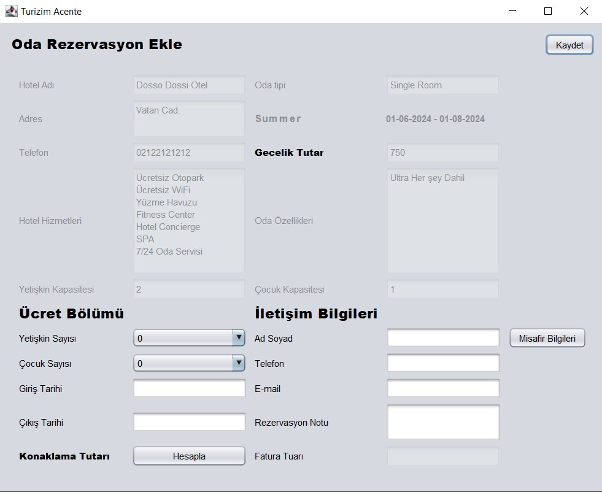
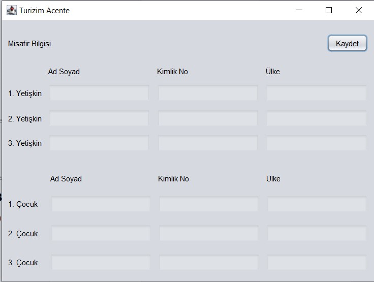
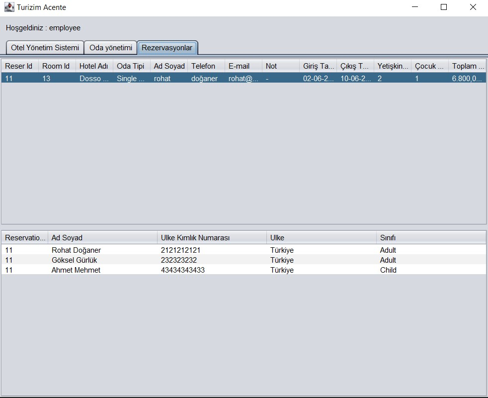

#Patika Turizm Acentesi Turizm Acente Sistemi
Bu proje, Patika Turizm Acentesi'nin günlük operasyonlarını dijital bir platforma taşımak için geliştirilmiş bir 
yazılım çözümüdür. Bu yazılım, otel yönetimi, oda yönetimi, dönem yönetimi, fiyat yönetimi, oda arama ve rezervasyon 
işlemleri gibi bir dizi özelliği içermektedir.

Kullanılan Teknolojiler
- Java
- Java Swing (GUI)
- PostgreSQL

Kurulum 
- Bu projeyi klonlayın.
- PostgreSQL veritabanında turizmacentesistemi adında bir veritabanı oluşturun.
- turizmacentesistemi.sql dosyasını kullanarak veritabanı tablolarını oluşturun.
Veritabanı bağlantısını yapılandırmak için DatabaseConnection.java dosyasını düzenleyin.

Proje Yapısı

- business: İş mantığını gerçekleştiren servis sınıfları

- core: Dizini altında veritabanı oluşturma dosyası, bulunmaktadır.

- dao: Veritabanı işlemlerini gerçekleştiren DAO (Data Access Object) sınıfları

- entity: Veritabanı tablolarını temsil eden model sınıfları

- views: Kullanıcı arayüzünü oluşturan Swing GUI sınıfları

Proje ile ilgili görseller :

Giriş Ekranı

Admin Kullanıcısının Ekranı :

Employee(Çalışan) Kullanıcısın Ekranları :

